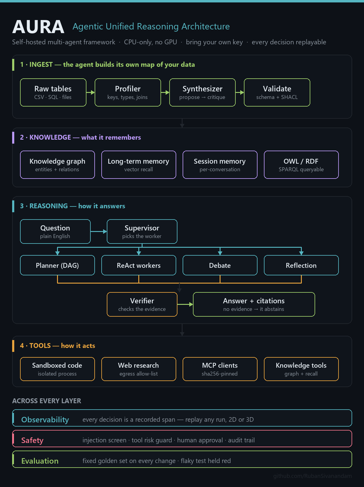
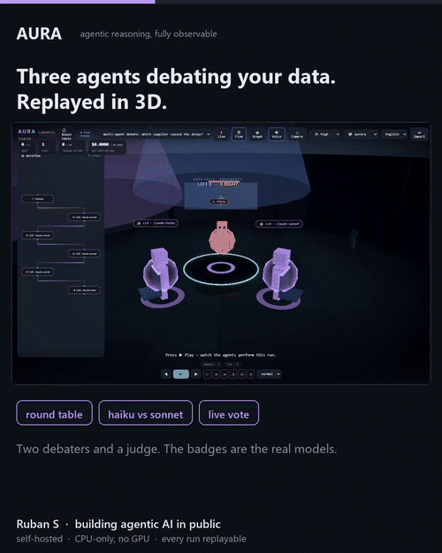
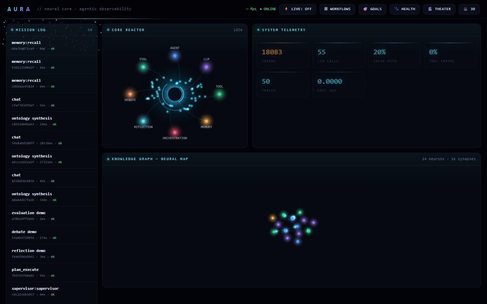

 

  

 

  

---

## In one sentence

**AURA lets you ask questions about your company's data in plain English, and shows you
exactly how the AI arrived at every answer.**

It runs on an ordinary laptop or your own server. No graphics card. No sending your data
to anyone else.

---

## The problem it solves

Imagine your company's data lives in database tables nobody documented. You want to know
*"which supplier delay cost us the most last quarter?"*

Today that means asking an engineer, who writes a database query, who comes back an hour
later. Multiply that by every question anyone has, every week.

You could point an AI at it. But there's a catch that stops most teams cold:

> **When an AI gives you a wrong answer, you usually just get the wrong answer.**
> No way to see which step went wrong, which data it looked at, or why it decided what it
> decided. For anything that touches a real business decision, "trust me" isn't good enough.

That's the actual problem. Not "can AI answer questions" — it can. The problem is **can you
check its work.**

## What AURA does about it

Four things, in order:

| | What happens | In plain terms |
|---|---|---|
| **1** | **It reads your data and figures it out** | You drop in your raw tables. It works out what a "customer" is, how orders connect to them, what the relationships are — without anyone writing that down first. |
| **2** | **You ask a question normally** | *"Who was my best customer this quarter?"* — typed the way you'd ask a colleague. |
| **3** | **It works, rather than guesses** | It plans the steps, looks things up, runs calculations, and has a second AI check the answer against the evidence before you see it. If the evidence isn't there, it says **"I don't know"** instead of inventing something. |
| **4** | **You can watch the whole thing back** | Every decision is recorded. You can replay the entire run, step by step, and see precisely what it did and why. |

Step 4 is the part that makes it different, and it's the reason the rest is trustworthy.

**And it all runs on your own machine.** Your data never leaves. That matters if you're in
a factory, a bank, a hospital, or anywhere with a network that doesn't reach the internet.

## Who is this for?

**This is a toolkit for developers building AI systems** — not an app you log into. A
developer uses it to build something your team then uses.

<table>
<tr><td width="50%" valign="top">

**A good fit when…**

- your data is sensitive and can't leave your network
- you need to *explain* an answer to a manager, an auditor, or a regulator
- you don't have (or don't want to pay for) expensive AI hardware
- you're tired of AI tools that are confidently wrong with no way to check

</td><td width="50%" valign="top">

**Probably not for you if…**

- you want a finished product with a login screen — this is a toolkit
- you need a huge library of ready-made plug-ins (LangChain has far more)
- you need proven massive scale across many servers — see the honest limits below

</td></tr>
</table>

---

> ### 📄 About this repository
>
> This repo is the **public record** of how AURA was built — the architecture, the full
> sprint-by-sprint ledger, the measured results and the methods behind them.
>
> **The code itself is in a private repository, so there's nothing here to install or run.**
> Every document here is the evidence trail for something that does exist and does work.
> Numbers on this page were measured, not estimated — and where something *isn't* proven,
> it says so.
>
> Want to talk through the internals, or discuss access? Contact details are at the bottom.

## Watch the agents think

The fastest way to understand AURA is to watch a run replay itself. Every decision is a
recorded span, so a completed run plays back beat by beat — as a 2D timeline, or on a
cinematic 3D stage where the supervisor routes, debaters argue at a round table, and the
judge scores.

 
<em>A real multi-agent debate, replayed. The badges are the actual models used per agent —
a cheap one and a strong one — and the left panel is the real execution graph. 
Captured from a live run; <a href="docs/assets/theater3d.png">full-resolution still here</a>.</em>

 

 
<em>Live telemetry from real runs: traces, model calls, cache-hit rate, token spend, tool-error rate.</em>

There are two kinds of replay, and the second one surprises people:

- **Watch it back** — the recording above. Useful for understanding and explaining.
- **Run it again for real** — [deterministic replay](REPLAY.md) re-executes the *actual
  code* using the answers the AI gave the first time. So a real run from last Tuesday
  becomes a test you can re-run today, offline, for free — and if a change broke
  something, it tells you immediately.

---

## How you'd actually use it

**Being straight with you: you can't install this today.** The code is private, so the
sections below describe what using it looks like, not something you can run right now. If
that's what you need, [get in touch](#contact).

Here's the shape of it:

**Set it up once.** A developer starts it with one command (`docker compose up`) on a
laptop or a server. You add one AI provider key. That's the setup.

**Feed it your data.** Point it at your database tables or drop files in a folder. It
reads them and builds its own map of what's in there — you don't write that map by hand.

**Connect it to whatever asks questions.** It exposes a normal web API, so your existing
app, an internal dashboard, or a chat interface can send questions and get answers back.

**Keep an eye on it.** A built-in dashboard shows every run, what each one cost, how often
tools failed, and lets you replay any of it.

Two things worth knowing because they're unusual:

- **Risky actions wait for a human.** Reading data happens freely. Anything that *changes*
  data queues up for someone to approve. You choose how much autonomy to give it.
- **Almost everything is switched off by default.** You turn on features after you've
  looked at them, rather than discovering them running.

---

## Common questions

<b>Is this a chatbot?</b>

 

No. A chatbot answers from what it already knows. AURA *does work* — it makes a plan, looks
things up in your actual data, runs calculations, checks its own answer, and shows you the
steps. The difference is between asking someone a question and asking them to go find out.

<b>Do I need an expensive graphics card or a big server?</b>

 

No. That's a deliberate design decision. It runs on an ordinary laptop CPU. The heavy
thinking happens at the AI provider you're already paying for; everything else — the
planning, the memory, the data, the checking — runs locally on normal hardware.

<b>Does my data get sent anywhere?</b>

 

Your data stays on your machine. Your database, your knowledge map, your history of runs —
all local.

The one exception, stated plainly: the *questions and relevant context* go to whichever AI
provider you configure, because that's the part doing the language understanding. If even
that is unacceptable, AURA can run against a **local model** on your own hardware instead,
and then nothing leaves at all.

<b>What if it gives a wrong answer?</b>

 

Three things are designed for exactly this:

1. A second AI checks the answer against the evidence before you see it.
2. If the evidence isn't there, it's built to say **"I don't know"** rather than guess.
3. If something still comes out wrong, you replay the run and see the precise step that
   broke — instead of shrugging at it.

It is not magic and it will get things wrong. The point is that you can *find out why*.

<b>How much does it cost to run?</b>

 

The software has no licence fee. Your cost is whatever your AI provider charges for the
questions you ask.

Two things reduce that: it sends easy work to a cheaper AI model and only hard work to the
expensive one, and it remembers repeated questions instead of paying twice. The dashboard
shows exactly what's being spent, broken down by model.

<b>Who maintains it? Is it safe to depend on?</b>

 

Honest answer: it's built and maintained by one engineer. It's been tested heavily —
around 1,300 automated tests that run on every change, across three versions of Python —
but it hasn't been battle-tested by lots of other teams at large scale yet.

Read the [honest limits](#honest-limits) section before putting it anywhere critical. That
section exists because you deserve to know the gaps, not just the highlights.

<b>Can I see it working?</b>

 

The screenshots and the animation above are real captures from actual runs — not mockups
or concept art. The dashboard numbers are genuine telemetry.

---

## The words, decoded

Technical writing below uses these. Here's what they mean in normal language:

| Term | What it actually means |
|---|---|
| **Agent** | AI that does a task in steps — plan, act, check — instead of replying once |
| **Multi-agent** | Several AIs with different jobs (one plans, one works, one checks) |
| **Ontology** | A map of your world: what a "customer" is, how orders connect to them |
| **Trace / span** | The recording of a run. A span is one decision inside it |
| **Replay** | Playing back a recorded run to see, or re-run, what happened |
| **Tool** | Something the AI can *use* — a database lookup, a calculator, a web search |
| **Token** | The unit AI providers bill you by, roughly ¾ of a word |
| **BYOK** | "Bring your own key" — you use your own AI account; nothing is resold to you |
| **Self-hosted** | Runs on your computer or server, not somebody else's cloud |
| **Golden set** | A fixed list of questions with known-correct answers, re-run on every change to prove nothing broke |

---

## Honest limits

Every project has these. Most README files hide them, which is exactly why they're worth
writing down.

- **It's a one-person project.** Heavily tested — around 1,300 automated tests on every
  change, across three Python versions — but not yet battle-tested by many teams at scale.
- **Built for one server.** It runs happily on a single machine. Spreading it across many
  servers is possible but isn't proven by the automated tests.
- **Some separation between teams is partial.** Different teams' *knowledge* is properly
  isolated, but the run history and approval queue are still shared. It's written down in
  the roadmap as a known gap, not quietly ignored.
- **No head-to-head win is claimed.** There's a comparison harness with its fairness
  caveats written out — that's deliberately different from claiming to beat anything.
- **Some results need a paid API key to demonstrate.** Where that's true, the document
  says so instead of implying the free test suite proved it.

That last habit is the one worth judging the project by. Anyone can build a demo; far
fewer write down what they *didn't* prove.

---

### ⬇️ Everything below is the technical detail

*If you just wanted to know what this is and what it does — you're done. The rest is the
evidence, for engineers who want to check the work.*

---

## The receipts

Every claim AURA makes has a document behind it. That's the point of this repo.

| Receipt | What it shows |
|---|---|
| **[RESULTS_BENCHMARKS.md](RESULTS_BENCHMARKS.md)** | Multi-model benchmark harness over τ²-bench / GAIA / SWE-bench / BFCL adapters — with an explicit statement of what is *not* proven without a key |
| **[RESULTS_RELIABILITY.md](RESULTS_RELIABILITY.md)** | Calibrated confidence, faithfulness gating, cost-aware routing, causal failure attribution |
| **[RESULTS_ONTOLOGY.md](RESULTS_ONTOLOGY.md)** | The ontology as a real OWL/RDF graph — 29 triples, 7/7 SPARQL competency questions, SHACL catching a dangling relation |
| **[RESULTS_MEMORY.md](RESULTS_MEMORY.md)** | Measured compression: fidelity 0.609 vs 0.0 on faithful vs vague summaries; intent-aware retrieval k=2 vs k=8 |
| **[METHODOLOGY.md](METHODOLOGY.md)** | How the framework comparison was run — including the fairness caveats that make the numbers honest |
| **[RESULTS_COMPARE.md](RESULTS_COMPARE.md)** | The comparison results themselves, caveats attached |
| **[REPLAY.md](REPLAY.md)** | Deterministic execution replay: the bundle format, the "a miss is the signal" contract, and an explicit list of what replay does **not** pin |
| **[ZERO_TRUST.md](ZERO_TRUST.md)** | Security posture: per-agent identity, capability authz, egress allow-list, memory integrity |
| **[SECURITY_ASI2026.md](SECURITY_ASI2026.md)** | Self-audit against OWASP's Top 10 for Agentic Applications (2026), ASI01–ASI10 |

## The ledger

**[ROADMAP.md](ROADMAP.md)** is the complete record: **149 bounded, individually-gated
sprints across 18 waves.** Each sprint is one reversible change behind an environment
flag, accepted only when three keyless gates stayed green, and reported as a measured
delta — never as "10x" or "100%".

It also records what I **declined to build**, and why. That half is the more useful half.

| Wave | Milestone | What it added |
|---|---|---|
| Foundation → Adoption | `v0.9.0` | Tool-use loop, self-building ontology, DAG planning, GraphRAG, packaging + CI |
| Measurably smarter | `v0.10.0` | A golden scoreboard *first*, then typed contracts, parallel fan-out, agentic retrieval |
| Self-learning | `v1.0.0` | Tenant isolation, runtime parity, memory compression, MCP trust enforcement |
| Ecosystem | `v1.1.0` | Five model backends, plugin registry, A2A v1.0, bidirectional MCP |
| Enterprise | `v1.2.0` | Distributed execution, durable workflows, compliance surface |
| Intelligence frontier | `v2.0.0` | Tool synthesis, cross-session learning, formal safety bounds, adversarial testing |
| Acts in the world | `v2.1.0` | Persistent scheduler, screened notifications, approval-gated connectors |
| Scale + Zero Trust | `v2.3.0` | WAL concurrency, exactly-once execution, per-agent identity, egress control |
| Orchestration + research | `v2.4.0` | Swarm topologies, benchmark leaderboard, autonomous researcher, eval-gated self-improvement |
| Agent tooling + MCP | `v2.5.0` | Sandboxed code interpreter, egress-gated web research, MCP registry |
| Brain 2.0 | `v2.6.0` | OWL/RDF export, SPARQL competency questions, SHACL validation |
| Memory 2.0 | `v2.7.0` | Measured compression fidelity, online semantic synthesis, intent-aware retrieval |
| **Determinism & Throughput** | *in progress* | **[Deterministic execution replay](REPLAY.md)** — re-execute a recorded run with its model answers injected, turning any recorded run into a keyless regression test |

## How it's built

**[HANDBOOK.md](HANDBOOK.md)** is the guided tour of the architecture, and
**[docs/TRACE_SCHEMA.md](docs/TRACE_SCHEMA.md)** documents the observability contract —
the span shape everything else is built on. A real exported run sits in
**[examples/sample_trace.json](examples/sample_trace.json)** if you'd rather read the
actual data structure than a description of it.

**[CHANGELOG.md](CHANGELOG.md)** has the release history.

---

## The engineering rules I held to

These are the reason the numbers above are worth anything.

**Measured, never claimed.** Every sprint reports a delta against a fixed golden set —
40 keyless fixtures across 7 categories. "It feels smarter" is banned.

**A flaky pass is not a pass.** A fixture that flip-flops across runs is held red until
it proves stable. One test that failed 11 times in 200 runs turned out to be a real
double-execution bug, not a flake.

**Three gates, every sprint, no exceptions.** Full test suite, a real end-to-end run,
and the golden-set report — all keyless, on Python 3.10, 3.11 and 3.12.

**Off by default.** Every capability ships behind an environment flag that defaults to
safe. With the flags unset, behaviour is byte-identical to the previous release — and
that's test-proven, not assumed.

**Attack your own work.** The sandbox, the egress allow-list and the skill audit were
each broken by a deliberate adversarial pass before shipping: a full-host escape in my
own sandbox, an SSRF-via-redirect around my own allow-list, and a security scanner I had
to honestly downgrade from "the boundary" to "one pre-filter" after it was defeated.
Those are written up in the ledger, not buried.

**Say what isn't proven.** Where a result needs an API key to demonstrate, the receipt
says so rather than implying the keyless gate covered it.

---

## Stack

Python · FastAPI · SQLite (WAL) · Kuzu · sqlite-vec · rdflib + pySHACL · three.js +
React Three Fiber · OpenTelemetry · Docker · Helm · GitHub Actions

Model-agnostic by design — five interchangeable backends, plus a keyless stub
backend that makes the entire test suite runnable with no API key at all.

## Contact

**Ruban S** — Software Engineer · Agentic AI · Chennai, India

Happy to walk through the architecture, the trace model, or any of the receipts above.
Source access can be discussed for a serious technical conversation.

[LinkedIn](https://www.linkedin.com/in/ruban-s-811964173/) · [GitHub](https://github.com/RubanSivanandam)

---

Documentation in this repository is licensed <strong>CC BY 4.0</strong> — see
<a href="LICENSE">LICENSE</a>. The AURA implementation is not included here and is not
covered by that licence.
